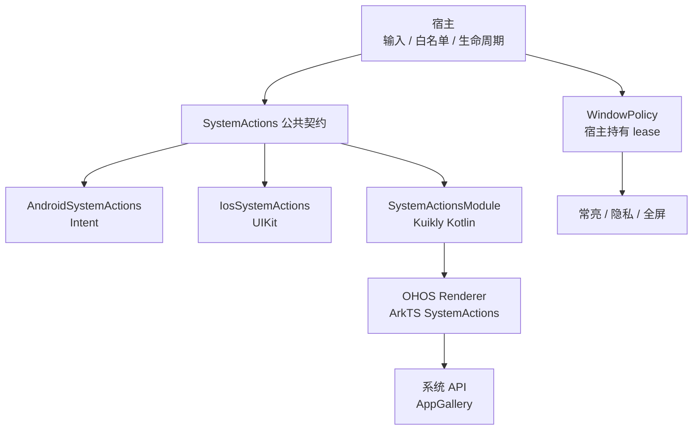
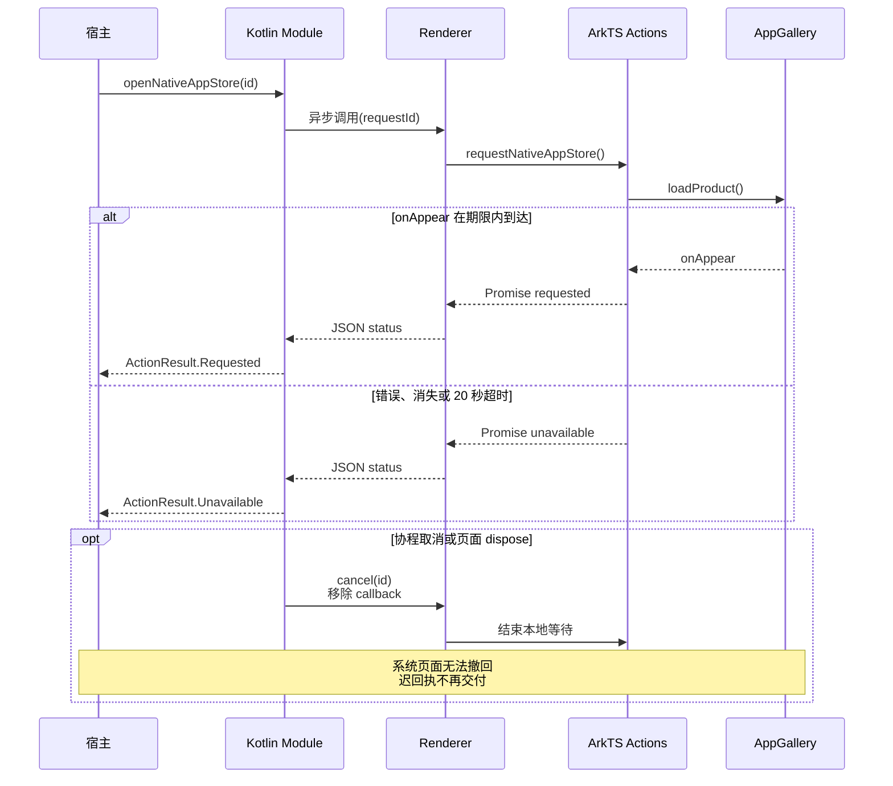
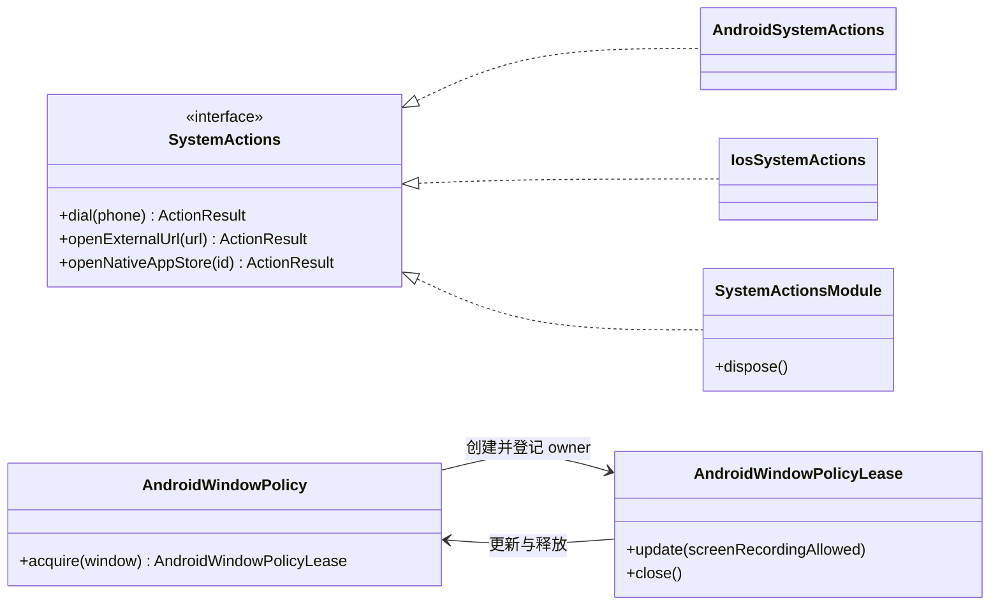

# GY CrossKit System Actions

## 当前功能与平台边界

core 提供系统动作；独立native服务提供窗口/观察能力。无CMP UI，system-actions-kuikly仅OHOS桥；A/i新观察与全屏需要宿主显式接线。

适用版本：Maven / Swift Package / Git Pod `0.2.0-rc.6`；HAR `0.2.0-rc.5`，独立标签 `native-0.2.0-rc.7`。当前能力见[功能与平台差异](docs/功能与平台差异.md)，发布及远程消费以固定 Release 验收为准。

当前测试覆盖、执行时点和未验收项集中见[验证范围](docs/功能与平台差异.md#验证范围)，复现命令见[开发与验证](docs/开发与验证.md)。

[历史完整源码审查](docs/完整源码审查.md) 列出全部生产文件、公开调用链、实际验证与未测项。

此版本补充 Android/iOS 原生键盘/主题观察、Android 全屏 owner，以及需要宿主显式 controller 支持的 iOS 全屏请求；见[原生观察与全屏接线](docs/接入指南.md#androidios-原生观察与全屏候选源码)。此版 Maven/Swift 包含这些新增 API；尚未替宿主接线或完成设备验收。

为 Android、iOS 和 HarmonyOS 提供拨号、HTTP(S) 外链、应用设置、定位设置、商店详情跳转，以及 OHOS 剪贴板、文件分享与常亮。宿主提供商店 URL、业务域名白名单和提示文案；库不绑定品牌包名，原生商店选择遵循下文的平台策略。

`copyText` / `shareFile` 使用共同 `SystemActions` 契约，Android/iOS 复用原文件服务。Android/iOS 观察和全屏服务适用于顶部当前版本，宿主仍需完成生命周期接线；各历史渠道结果见下方发布记录。

## 架构与调用流程

系统动作与 Window 策略是两条独立入口：前者返回系统受理结果，后者由宿主持有 lease。KMP OHOS 通过 Kuikly 调用 HAR；Swift Window 工具是独立原生产物。



下面以 OHOS 原生商店为例：`loadProduct` 本身不返回成功，只有 `onAppear` 才结算 `requested`。其他系统动作的返回时点取决于平台；Android `startActivity` 受理后返回，iOS 等待 `openURL` completion。



核心类型关系如下（只列 Kotlin 类型）。Android lease 在主线程同步更新；最后一个 owner 关闭后恢复进入前 flags。OHOS Window 操作使用共享串行队列，必须等待 `update` 成功再展示内容，`release` 等待窗口恢复；宿主负责释放自己的 lease。



源码入口：[公共动作契约](system-actions-core/src/commonMain/kotlin/io/github/gycrosskit/systemactions/SystemActions.kt)、[Android 动作](system-actions-core/src/androidMain/kotlin/io/github/gycrosskit/systemactions/AndroidSystemActions.kt)、[iOS 动作](system-actions-core/src/iosMain/kotlin/io/github/gycrosskit/systemactions/IosSystemActions.kt)、[Kuikly 请求生命周期](system-actions-kuikly/src/commonMain/kotlin/io/github/gycrosskit/systemactions/kuikly/SystemActionsModule.kt)、[OHOS Renderer](ohos/system-actions-native/src/main/ets/GycSystemActionsModule.ets)、[OHOS 商店回执](ohos/system-actions-native/src/main/ets/SystemActions.ets)、[Android Window owner](system-actions-core/src/androidMain/kotlin/io/github/gycrosskit/systemactions/AndroidWindowPolicy.kt)、[OHOS Window 队列](ohos/system-actions-native/src/main/ets/WindowPolicy.ets)。iOS/OHOS 定位设置、iOS 原生商店返回不可用，图中的平台入口不表示每个动作均受支持。

## 平台与模块

| 模块 | 平台与要求 |
| --- | --- |
| `system-actions-core` | Android API 24+ / iOS（宿主基线 iOS 14+）；公共 `SystemActions` 与原生实现 |
| `system-actions-kuikly` | OHOS Kotlin Module；Kuikly `2.28.0-2.0.21-ohos` |
| `@gycrosskit/system-actions-native` | HarmonyOS API 22 兼容 HAR；原生 ArkTS 和 Kuikly Renderer Module，render `2.28.0` |

KMP 工具链基线为 OpenHarmony Kotlin `2.2.21-1.0.0` / JDK 17 / Gradle 8.11.1 / AGP 8.10.1。iOS 编译链接需 macOS / Xcode，OHOS 需匹配 Native SDK。Core 的 OHOS 和 JVM 变体仅包含公共 API；JVM 不提供桌面系统动作。

<a id="window-与原生系统边界020-rc3-历史记录"></a>

## Window 与原生系统边界

Android Core 提供常亮和 `FLAG_SECURE` lease、`AndroidFileActions`；iOS 原生 `GYCWindowPolicy`
Swift Package / Git Pod 提供常亮、录屏/镜像黑遮罩与 UIKit 工具，同版 KMP Core 提供文件分享与剪贴板。
OHOS HAR 的 fullscreen/privacy 在同一 Ability 共用一个 `WindowPolicyController` 与队列，窗口 layout/fullscreen
分别保存；跨 View 接管累计恢复已修改的窗口状态。宿主输入方向、系统栏目标和业务录屏准入。
iOS 使用公开 UIKit，无法阻止静态截图。Android API 24+、iOS 14+、HarmonyOS API 22。

```kotlin
val lease = AndroidWindowPolicy.acquire(activity.window) // 主线程，默认常亮且禁录
lease.update(screenRecordingAllowed = true)
lease.close() // 最后一个 owner 释放后恢复进入前的 flags
```

```swift
import GYCWindowPolicy
// 在 MainActor；宿主提供当前 Window resolver。
let policy = WindowPolicyController { hostWindow }
let lease = policy.acquire()
lease.update(screenRecordingAllowed: true)
lease.end()
```

```typescript
import { WindowPolicyController, window } from '@gycrosskit/system-actions-native';
// Ability 创建时持有；同一 Ability 各页共用，不同 Ability 分开。
const windowPolicy = new WindowPolicyController();
const lease = windowPolicy.createLease(() => window.getLastWindow(context));
await lease.update(false); // 必须成功后才展示视频
await lease.update(true);
await lease.release();
```

HAR 0.2.0-rc.5 允许 `GycSystemActionsModule(actions, windowPolicy)` 注入上述 Ability 级 controller；省略参数仅兼容原单 Ability 接入。多 Ability 接入需采用 HAR 0.2.0-rc.5 或后续兼容版本，详见接入指南。

多 owner 与异步释放、Swift/CocoaPods 接线和限制见[接入指南](docs/接入指南.md#window-策略)。本地验证方法见[开发与验证](docs/开发与验证.md#window-策略验证)。

## 既有系统边界

既有发布版本提供剪贴板/私有文件分享、共用 UIKit 执行与 presenter 解析、OHOS 键盘/环境观察及全屏窗口 lease。
当前配套版本见顶部基线，接线示例见[系统边界迁移](docs/接入指南.md#系统边界迁移020-rc2)。
Android 增加 AndroidX Core 1.16.0 以复用 FileProvider，但 provider 和私有目录仍由宿主唯一声明。
iOS KMP 分享分别返回面板受理和实际 completion 终态；Swift 工具仍属于现有 `GYCWindowPolicy` product。
OHOS fullscreen 与 privacy 在同一 Ability 共用 controller 和串行队列，宿主输入方向/系统栏目标，
页面、主题、退出任务和 WebView 的 `FullScreenExitHandler` 保留在宿主或 WebView 事件层。

## 安装

项目 `settings.gradle.kts` 的依赖仓库：

```kotlin
dependencyResolutionManagement {
    repositories {
        google()
        mavenCentral()
        maven { url = uri("https://jitpack.io") }
        maven { url = uri("https://maven.eazytec-cloud.com/nexus/repository/maven-public/") }
        maven { url = uri("https://mirrors.tencent.com/nexus/repository/maven-tencent/") }
    }
}
```

共享模块 `build.gradle.kts`：

```kotlin
kotlin {
    sourceSets {
        commonMain.dependencies {
            implementation("com.github.gycrosskit.system-actions:system-actions-core:0.2.0-rc.6")
        }
    }
}
```

HarmonyOS 原生宿主：

```sh
# 当前配套 HAR；按精确版本安装
ohpm install @gycrosskit/system-actions-native@0.2.0-rc.5
```

Kotlin 插件仓库及 Kuikly 双侧注册见[接入指南](docs/接入指南.md)。此版 Maven rc.6 配套 HAR rc.5，Swift Package/Git Pod 使用 rc.6；HAR rc.4 的精确 Registry 查询与专属空缓存安装记录见 [rc.5 验收](docs/0.2.0-rc.5候选验收.md)，固定 Release HAR 校验/消费结果见 [rc.4 发布验收](docs/0.2.0-rc.4发布验收.md)。上一版 rc.3 的 SHA 安装步骤保留在接入指南历史段落。历史 Registry `0.1.1` 不含 Window 策略，不能替代当前 HAR；此版 Maven/Swift 包含 Android/iOS 观察/全屏 API，仍需宿主显式接线。

## 快速使用

Android 在 `androidMain` 创建实现：

```kotlin
import io.github.gycrosskit.systemactions.AndroidSystemActions
val actions = AndroidSystemActions(context)
```

iOS 在 `iosMain` 使用 `IosSystemActions()`。共享业务在宿主协程中调用：

```kotlin
import io.github.gycrosskit.systemactions.ActionResult
import io.github.gycrosskit.systemactions.SystemActions

suspend fun openHelp(actions: SystemActions): ActionResult =
    actions.openExternalUrl("https://example.com/help")
```

还支持 `dial(phone)`、`openAppSettings()`、`openLocationSettings()`、`openAppStore(listingUrl)`；新增 `openNativeAppStore(applicationId = null)`。`Requested` 仅表示系统受理，`InvalidInput` 表示输入拒绝，`Unavailable` 表示无法打开。ArkTS 的对应状态为 `requested` / `invalid_input` / `unavailable`。

原生商店使用当前应用标识或宿主显式传入的 applicationId/bundleName：Android 优先匹配设备厂商商店，再尝试固定第三方商店；OHOS 使用 AppGallery `loadProduct` 并等待 `onAppear`，iOS 返回 `Unavailable`。业务商店 URL 和升级决策继续由宿主提供。取消和超时结束等待，不能关闭 SDK 已显示的商店页面。

Android 拨号使用 `ACTION_DIAL`，不申请直接呼叫权限。定位服务设置仅支持 Android；iOS/OHOS 返回不可用。商店地址只接受 HTTP(S)，可能由商店或浏览器处理；系统调用取消后无法撤回已打开页面。

输入格式、平台回执和 Kuikly 页面 `dispose()` 边界见接入指南。

## 文档与支持

- [接入指南](docs/接入指南.md)：三端 API、输入规则、主线程和 Kuikly 生命周期。
- [开发与验证](docs/开发与验证.md)、[历史验收记录](verification/验收记录.md)：源码验证与独立消费。
- [Window 预发布验收](verification/Window策略候选验收.md)：`0.2.0-rc.1` PR、标签、归档校验、三平台远程消费与 OHPM 审核边界。
- [历史远程发布验收](verification/远程发布验收.md)：Maven `0.1.3` / HAR `0.1.2` 历史记录。
- [GitHub Releases](https://github.com/gycrosskit/system-actions/releases)：Maven / HAR 版本和归档。
- [GitHub Issues](https://github.com/gycrosskit/system-actions/issues)：提供平台、版本、输入和最小复现。

已有记录覆盖 Android/iOS/OHOS 远程产物消费、iOS Simulator Framework 链接、OHPM Registry 安装与 HAR 编译；真实系统页面和 Kuikly 设备交互仍待验收。

自有源码使用 [Apache-2.0](LICENSE)，第三方依赖遵循各自许可。

## 历史发布记录

以下记录保留对应版本、渠道与验收时点，不替代顶部当前功能和安装基线。

- <a id="020-rc4-历史发布记录"></a>[rc.4 发布与 HAR API 首次提供记录](docs/0.2.0-rc.4发布验收.md)、[rc.5 候选及 2026-10-07 Registry 复验](docs/0.2.0-rc.5候选验收.md)。
- [rc.3 远程验收与版本修复](verification/rc3远程发布验收.md)、[rc.2 系统边界验收](verification/系统边界闭合候选验收.md)、[rc.1 Window 验收](verification/Window策略候选验收.md)。
- [Maven 0.1.3 / HAR 0.1.2 原生商店与渠道历史](verification/远程发布验收.md)。

## 自动回归

[Component regression](.github/workflows/regression.yml) 按事件分阶段：PR 先判断变更范围，仅源码变更运行已有 Android/Native 测试与编译；纯文档 PR 和 `main` push 只运行轻量脚本/配置检查。手动运行不填版本时执行源码回归，未知路径保守按源码处理。源码 PR 执行验收，main 保持轻量检查，Release 验证精确远程坐标与消费者；线上耗时以实际 Actions 运行为准。

Maven Release 发布或手动填写精确已发布版本时，`verify-public` 统一校验一次冻结归档、精确 tag/commit、完整 publication 清单和公开文件；通过后 Android/Native 独立消费者从 JitPack 解析该版本。PR 不再反复消费旧基线；不使用 `mavenLocal`、本库源码或归档替换远程依赖。此流程不发布二进制。

OHOS KLIB 编译不代表 HAR 构建、ohpm 上架或真机验收。当前没有已确认可用的 DevEco/Hvigor runner，这些检查尚未自动化，不能作为 CI 通过范围。

阶段、缓存、有限网络重试、失败记录与证据边界见[共用 CI 规则](https://github.com/gycrosskit/.github/blob/main/docs/持续集成门禁.md)；本库实际平台命令以 workflow 为准。源码通过、远程消费、HAR/ohpm 与设备验收分别记录。

## CMP / Kuikly 共用系统服务

`SystemActions.copyText` 和 `shareFile` 与拨号/外链一样，供 shared Kotlin 使用。Android 的两种 UI 入口都可持有 `AndroidSystemActions(context, fileProviderAuthority)`；authority 和目录映射来自宿主既有唯一 FileProvider。iOS 两种入口都可把既有 `IosFileActions(presenterResolver)` 传入 `IosSystemActions(fileActions)`，宿主退出时关闭原文件服务，不缓存旧 Scene，不另造 presenter。OHOS 使用现有 `SystemActionsModule` 与 HAR。默认缺少 Provider/presenter 时分享明确 `Unavailable`；`Requested` 是面板受理，用户分享完成结果仍由原平台文件 API 提供。

WindowPolicy 保持独立多 owner lease：Android 复用 `AndroidWindowPolicy.acquire` 并 `close`，iOS 复用 Swift `WindowPolicyController.acquire` 并 `end`，OHOS 复用 HAR 的对应 owner 并 release。CMP、Kuikly 与播放器共享宿主既有 owner，不重复嵌套新 owner；最后一个 owner 结束时恢复原有常亮/保护状态。iOS 只支持录屏/镜像遮罩，不能承诺禁止静态截图。键盘与主题属于宿主 UI 策略，未添加全能 common 平台服务。
