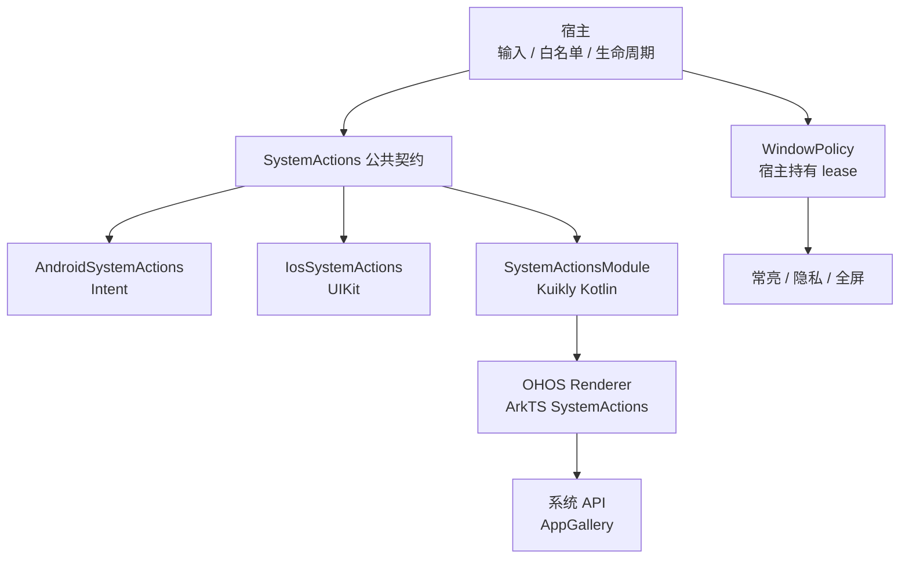
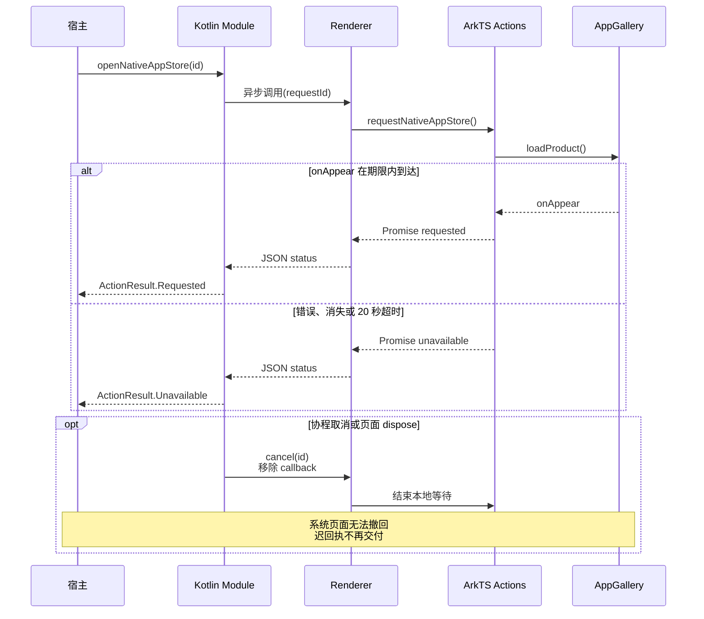
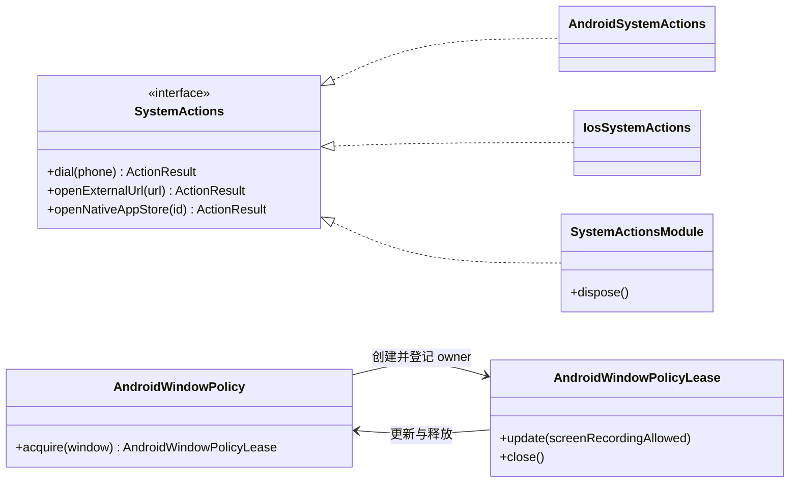

# GY CrossKit System Actions

[本轮完整源码审查](docs/完整源码审查.md) 列出全部生产文件、公开调用链、实际验证与未测项。

为 Android、iOS 和 HarmonyOS 提供拨号、HTTP(S) 外链、应用设置、定位设置及商店详情跳转；`0.2.0-rc.4` 预发行补齐 OHOS 剪贴板、文件分享与常亮，并保留原生系统边界。宿主提供商店 URL、业务域名白名单和提示文案；库不绑定品牌包名，原生商店选择遵循下文的平台策略。

## 0.2.0-rc.4 发布状态

Maven core/Kuikly `0.2.0-rc.4` 已提供 GitHub 预发行，JitPack 的精确标签/提交、完整 publication 和实际文件校验通过。Release HAR 已重下载校验；OHPM 以独立 `candidate-0.2.0-rc.4` 标签提交审核，精确 Registry 安装仍返回 NOTFOUND，旧 next 保持。详情见[0.2.0-rc.4 发布验收](docs/0.2.0-rc.4发布验收.md)。 Swift Package/Git Pod 保持已验 `0.2.0-rc.2`。

OHOS `SystemActions.copyText(value)` 与 `shareFile(path, title)` 提供剪贴板和普通私有文件分享。`WindowPolicyController.createLease(resolver, keepScreenOn = false)` 增加常亮意图；旧调用维持默认行为。Kuikly Module 同步提供 `copyText`、`shareFile` 和 `setKeepScreenOn`。这些能力随 rc.4 GitHub 预发行提供；OHPM 候选仍在审核，旧 rc.3 不含该能力。

## 架构与调用流程

系统动作与 Window 策略是两条独立入口：前者返回系统受理结果，后者由宿主持有 lease。KMP OHOS 通过 Kuikly 调用 HAR；Swift Window 工具是独立原生产物。



下面以 OHOS 原生商店为例：`loadProduct` 本身不返回成功，只有 `onAppear` 才结算 `requested`。其他系统动作的返回时点取决于平台；Android `startActivity` 受理后返回，iOS 等待 `openURL` completion。



核心类型关系如下（只列 Kotlin 类型）。Android lease 在主线程同步更新；最后一个 owner 关闭后恢复进入前 flags。OHOS Window 操作使用共享串行队列，必须等待 `update` 成功再展示内容，`release` 等待窗口恢复；宿主负责释放自己的 lease。



源码入口：[公共动作契约](system-actions-core/src/commonMain/kotlin/io/github/gycrosskit/systemactions/SystemActions.kt)、[Android 动作](system-actions-core/src/androidMain/kotlin/io/github/gycrosskit/systemactions/AndroidSystemActions.kt)、[iOS 动作](system-actions-core/src/iosMain/kotlin/io/github/gycrosskit/systemactions/IosSystemActions.kt)、[Kuikly 请求生命周期](system-actions-kuikly/src/commonMain/kotlin/io/github/gycrosskit/systemactions/kuikly/SystemActionsModule.kt)、[OHOS Renderer](ohos/system-actions-native/src/main/ets/GycSystemActionsModule.ets)、[OHOS 商店回执](ohos/system-actions-native/src/main/ets/SystemActions.ets)、[Android Window owner](system-actions-core/src/androidMain/kotlin/io/github/gycrosskit/systemactions/AndroidWindowPolicy.kt)、[OHOS Window 队列](ohos/system-actions-native/src/main/ets/WindowPolicy.ets)。iOS/OHOS 定位设置、iOS 原生商店返回不可用，图中的平台入口不表示每个动作均受支持。

## 平台与模块

| 模块 | 平台与要求 |
| --- | --- |
| `system-actions-core` | Android API 24+ / iOS（宿主基线 iOS 14+）；公共 `SystemActions` 与原生实现 |
| `system-actions-kuikly` | OHOS Kotlin Module；Kuikly `2.28.0-2.0.21-ohos` |
| `@gycrosskit/system-actions-native` | HarmonyOS API 22 兼容 HAR；原生 ArkTS 和 Kuikly Renderer Module，render `2.28.0` |

KMP 工具链基线为 OpenHarmony Kotlin `2.2.21-1.0.0` / JDK 17 / Gradle 8.11.1 / AGP 8.10.1。iOS 编译链接需 macOS / Xcode，OHOS 需匹配 Native SDK。Core 的 OHOS 和 JVM 变体仅包含公共 API；JVM 不提供桌面系统动作。

## Window 与原生系统边界（0.2.0-rc.3 候选）

上一版 `0.2.0-rc.3` 修正 layout-only 全屏退出时不应回写方向的问题。Maven/HAR 已发布为 prerelease，JitPack 最终 ok 且全变体字节核验通过；真实远程 Android/iOS/OHOS 编译、Simulator 最终链接与 Release HAR 消费已通过，OHPM next 已接受但精确版本仍 NOTFOUND/审核中；无变化的 Swift Package/Git Pod 继续使用已验证 rc.2。既有 rc.2 已新增剪贴板/私有文件分享、共用 UIKit 执行与 presenter 解析、
OHOS 键盘/环境观察及全屏 Window lease。历史 rc.2 的 Maven、Git Pod 与 Swift Package 独立消费者编译/链接已通过；发布与各渠道结果见
[rc.3 远程验收](verification/rc3远程发布验收.md)，尚未完成的渠道不视为可安装。
`0.2.0-rc.1` 为此前已发布的 Window 基线，2026-10-04 OHPM 精确查询仍返回 `NOTFOUND`。

Android Core 提供常亮和 `FLAG_SECURE` lease、`AndroidFileActions`；iOS 原生 `GYCWindowPolicy`
Swift Package / Git Pod 提供常亮、录屏/镜像黑遮罩与 UIKit 工具，同版 KMP Core 提供文件分享与剪贴板。
OHOS HAR 的 fullscreen/privacy 共用 `WindowPolicyController.shared` 与队列，窗口 layout/fullscreen
分别保存；跨 View 接管累计恢复已修改的窗口状态。宿主输入方向、系统栏目标和业务录屏准入。
iOS 使用公开 UIKit，无法阻止静态截图。Android API 24+、iOS 14+、HarmonyOS API 22。

```kotlin
val lease = AndroidWindowPolicy.acquire(activity.window) // 主线程，默认常亮且禁录
lease.update(screenRecordingAllowed = true)
lease.close() // 最后一个 owner 释放后恢复进入前的 flags
```

```swift
import GYCWindowPolicy
// 在 MainActor；宿主提供当前 Window resolver。
let policy = WindowPolicyController { hostWindow }
let lease = policy.acquire()
lease.update(screenRecordingAllowed: true)
lease.end()
```

```typescript
import { WindowPolicyController, window } from '@gycrosskit/system-actions-native';
const lease = WindowPolicyController.shared.createLease(() => window.getLastWindow(context));
await lease.update(false); // 必须成功后才展示视频
await lease.update(true);
await lease.release();
```

多 owner 与异步释放、Swift/CocoaPods 接线和限制见[接入指南](docs/接入指南.md#window-策略)。本地验证方法见[开发与验证](docs/开发与验证.md#window-策略验证)。

## 本轮系统边界闭合

当前分支增加剪贴板/私有文件分享、共用 UIKit 执行与 presenter 解析、OHOS 键盘/环境观察及全屏窗口 lease。
这些 API 从 0.2.0-rc.2 开始提供；HAR尚在审核，不能以旧Registry包代替；接线示例见[系统边界迁移](docs/接入指南.md#系统边界迁移020-rc2)。
Android 增加 AndroidX Core 1.16.0 以复用 FileProvider，但 provider 和私有目录仍由宿主唯一声明。
iOS KMP 分享分别返回面板受理和实际 completion 终态；Swift 工具仍属于现有 `GYCWindowPolicy` product。
OHOS fullscreen 与 privacy 共用 `WindowPolicyController.shared` 和串行队列，宿主输入方向/系统栏目标，
页面、主题、退出任务和 WebView 的 `FullScreenExitHandler` 保留在宿主或 WebView 事件层。

## 安装

项目 `settings.gradle.kts` 的依赖仓库：

```kotlin
dependencyResolutionManagement {
    repositories {
        google()
        mavenCentral()
        maven { url = uri("https://jitpack.io") }
        maven { url = uri("https://maven.eazytec-cloud.com/nexus/repository/maven-public/") }
        maven { url = uri("https://mirrors.tencent.com/nexus/repository/maven-tencent/") }
    }
}
```

共享模块 `build.gradle.kts`：

```kotlin
kotlin {
    sourceSets {
        commonMain.dependencies {
            implementation("com.github.gycrosskit.system-actions:system-actions-core:0.2.0-rc.4")
        }
    }
}
```

HarmonyOS 原生宿主：

```sh
# rc.4 发布且审核可见后使用；候选尚未发布
ohpm install @gycrosskit/system-actions-native@0.2.0-rc.4
```

Kotlin 插件仓库及 Kuikly 双侧注册见[接入指南](docs/接入指南.md)。本轮 Maven/HAR 候选精确使用 `0.2.0-rc.4`，尚未发布；上一版 rc.3 的固定 Release HAR SHA 安装步骤保留在接入指南历史段落。历史 Registry `0.1.1` 不含 Window 策略，不能替代本轮 HAR。

原生商店增强的历史稳定版本为 [Maven `0.1.3`](https://github.com/gycrosskit/system-actions/releases/tag/0.1.3)，JitPack 构建成功。[HAR `0.1.2` 归档](https://github.com/gycrosskit/system-actions/releases/tag/har-0.1.2)独立发布，当前 OHPM 公开元数据已列出 `0.1.2` 且 `latest=0.1.2`。它不含本轮 Window 与系统边界 API；旧审核期间的 NOTFOUND 留在历史验收记录。API 与回执边界见接入指南。

## 快速使用

Android 在 `androidMain` 创建实现：

```kotlin
import io.github.gycrosskit.systemactions.AndroidSystemActions
val actions = AndroidSystemActions(context)
```

iOS 在 `iosMain` 使用 `IosSystemActions()`。共享业务在宿主协程中调用：

```kotlin
import io.github.gycrosskit.systemactions.ActionResult
import io.github.gycrosskit.systemactions.SystemActions

suspend fun openHelp(actions: SystemActions): ActionResult =
    actions.openExternalUrl("https://example.com/help")
```

还支持 `dial(phone)`、`openAppSettings()`、`openLocationSettings()`、`openAppStore(listingUrl)`；新增 `openNativeAppStore(applicationId = null)`。`Requested` 仅表示系统受理，`InvalidInput` 表示输入拒绝，`Unavailable` 表示无法打开。ArkTS 的对应状态为 `requested` / `invalid_input` / `unavailable`。

原生商店使用当前应用标识或宿主显式传入的 applicationId/bundleName：Android 优先匹配设备厂商商店，再尝试固定第三方商店；OHOS 使用 AppGallery `loadProduct` 并等待 `onAppear`，iOS 返回 `Unavailable`。业务商店 URL 和升级决策继续由宿主提供。取消和超时结束等待，不能关闭 SDK 已显示的商店页面。

Android 拨号使用 `ACTION_DIAL`，不申请直接呼叫权限。定位服务设置仅支持 Android；iOS/OHOS 返回不可用。商店地址只接受 HTTP(S)，可能由商店或浏览器处理；系统调用取消后无法撤回已打开页面。

输入格式、平台回执和 Kuikly 页面 `dispose()` 边界见接入指南。

## 文档与支持

- [接入指南](docs/接入指南.md)：三端 API、输入规则、主线程和 Kuikly 生命周期。
- [开发与验证](docs/开发与验证.md)、[历史验收记录](verification/验收记录.md)：源码验证与独立消费。
- [Window 预发布验收](verification/Window策略候选验收.md)：`0.2.0-rc.1` PR、标签、归档校验、三平台远程消费与 OHPM 审核边界。
- [历史远程发布验收](verification/远程发布验收.md)：Maven `0.1.3` / HAR `0.1.2` 历史记录。
- [GitHub Releases](https://github.com/gycrosskit/system-actions/releases)：Maven / HAR 版本和归档。
- [GitHub Issues](https://github.com/gycrosskit/system-actions/issues)：提供平台、版本、输入和最小复现。

已有记录覆盖 Android/iOS/OHOS 远程产物消费、iOS Simulator Framework 链接、OHPM Registry 安装与 HAR 编译；真实系统页面和 Kuikly 设备交互仍待验收。

自有源码使用 [Apache-2.0](LICENSE)，第三方依赖遵循各自许可。
